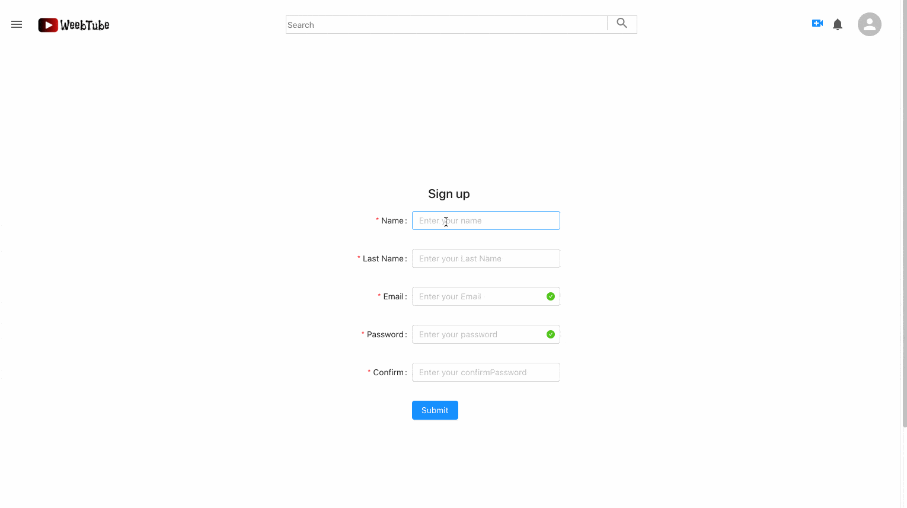
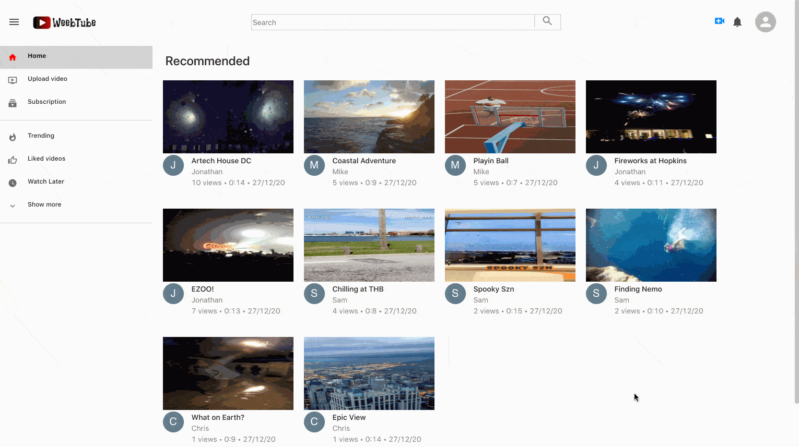
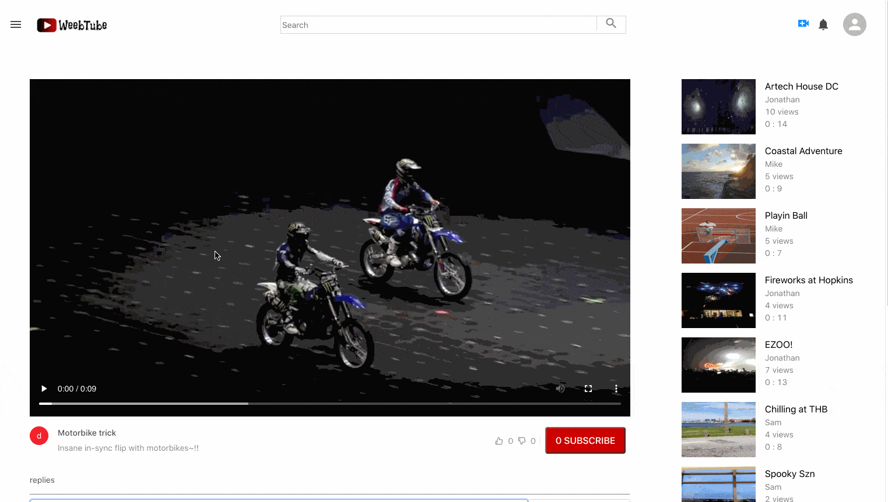
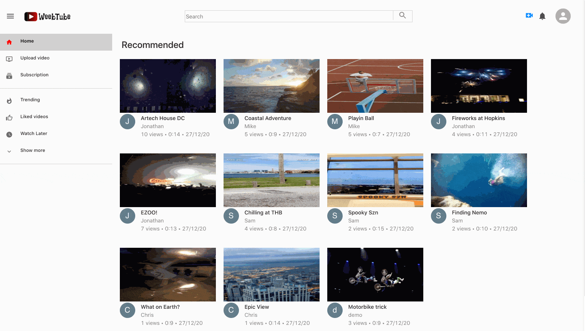

# weebTube - youtube clone :)
### **[Visit the Live Site here](https://weebtube.herokuapp.com/)**  


## Complete Tech 

1.React/Redux.<br> 
2.Express.<br> 
3.Mongoose/MongoDB. <br> 
4.HTML/CSS. <br>

## Key Features
#### User Authentication

* Users can sign up or log in with an existing account.  
* Invalid logins or incorrect signup requests will prompt validation errors on both the frontend and the backend.  
* Certain features of the web app will be blocked if users are not logged in, feature implemented using jsonwebtoken.
* Incorporated Remember Me feature, to store user data in local storage for future vists. 
* Implemented auth feature using higher order function.

```
export default function (SpecificComponent, option, adminRoute = null) {
    function AuthenticationCheck(props) {

        let user = useSelector(state => state.user);
        const dispatch = useDispatch();

        useEffect(() => {
            //To know my current status, send Auth request 
            dispatch(auth()).then(response => {
                //Not Logged in Status 
                if (!response.payload.isAuth) {
                    if (option) {
                        props.history.push('/login')
                    }
                    //Logged in Status 
                } else {
                    //supposed to be Admin page, but not admin person wants to go inside
                    if (adminRoute && !response.payload.isAdmin) {
                        props.history.push('/')
                    }
                    //Logged in Status, but Try to go into log in page 
                    else {
                        if (option === false) {
                            props.history.push('/')
                        }
                    }
                }
            })

        }, [])

        return (
            <SpecificComponent {...props} user={user} />
        )
    }
    return AuthenticationCheck
}
```


#### Upload Videos && Views

* Views dynamically update after watching a video on all routes, and will continue to the next session.
* Users can upload videos (Public or Private) -- feature turned not implemented in demo for safety



#### Like, Comment && Subscribe

* Likes, comments and subscription all dynamically update from session to session, and if viewing with another user.
* Liking feature added for comments as well as videos. 
* Comments can chained in a recursive manner, for an interactive experience. 
* Users can also subscribe to one another and go to the sidebar "Subscription" panel to see all of their favorite channels. 





## Future Direction
* Finishing the like and watch later panels.
* Adding Notifications.
